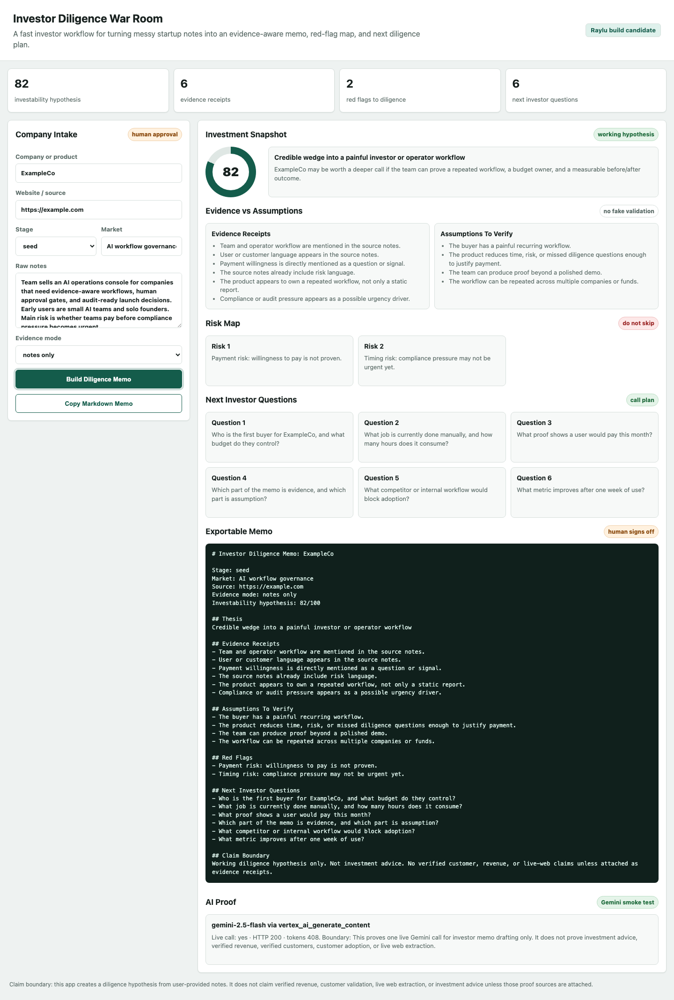

# Investor Diligence War Room

Investor Diligence War Room is a fast AI-era workflow for turning messy startup notes into an evidence-aware investment memo.

It is being built for Build & Pitch w/ Raylu.

## Public Links

- Live app: https://daideguchi.github.io/investor-diligence-war-room/
- GitHub repo: https://github.com/daideguchi/investor-diligence-war-room
- Submission status: not final-submitted yet

## Judge Quick Read

Target user:

```text
VCs, scouts, accelerators, angels, and founders doing early market diligence.
```

Problem:

```text
Early diligence is usually messy. Investors collect notes, websites, founder claims, market guesses, and scattered questions. AI can draft a memo quickly, but it often blurs evidence, assumptions, and confident-sounding guesses.
```

Solution:

```text
Investor Diligence War Room creates a memo while separating evidence receipts, assumptions, red flags, and next investor questions. It keeps the investor in control and labels the score as a working hypothesis, not a fact.
```

## What It Does

- Takes company, website, stage, market, and raw notes.
- Generates an investability hypothesis.
- Separates evidence from assumptions.
- Builds red flags and next diligence questions.
- Exports a Markdown memo.
- Displays a sanitized Gemini live-call proof when the proof JSON is available.
- Keeps a clear claim boundary.

## Screenshot



## Demo Video Asset

Current local demo asset:

```text
media/investor-diligence-war-room-demo.webm
```

This is a silent product walkthrough asset for review and later YouTube/Devpost packaging.

## AI Proof

The app is designed for model-backed memo drafting, but the public workflow keeps the evidence boundary visible.

One sanitized Vertex AI Gemini smoke proof can be generated locally:

```bash
GOOGLE_VERTEX_SERVICE_ACCOUNT_JSON=/path/to/service-account.json \
GOOGLE_VERTEX_PROJECT=pj260519 \
GOOGLE_VERTEX_LOCATION=us-central1 \
GOOGLE_VERTEX_MODEL=gemini-2.5-flash \
node scripts/run_vertex_gemini_smoke.mjs
```

The proof file is written to:

```text
media/gemini-live-diligence-proof.json
```

The public app reads that sanitized proof and displays the model, route, HTTP status, token count, and claim boundary. It does not expose credentials.

## What It Does Not Claim

- It is not investment advice.
- It does not claim verified revenue or customer validation.
- It does not claim live web extraction yet.
- It does not replace investor judgment.
- It does not make a final investment decision.

## Why It Fits Raylu

Raylu's hackathon is judged by whether a project is useful in the real world, technically working, novel, and easy to sell in a short demo.

This product is aimed directly at that surface:

- a real buyer persona
- a business workflow
- a practical demo
- a clear before/after story
- a product that could become a paid diligence tool

## Run Locally

```bash
open index.html
```

## Verification

```bash
node scripts/verify_app.mjs
python3 scripts/verify_claim_boundary.py
python3 scripts/verify_no_secrets.py
```

Full local check:

```bash
npm run verify
```

Record the current product walkthrough:

```bash
npm run demo:record
```

## Submission Boundary

Current status:

```text
Public prototype live on GitHub Pages.
No final Devpost submission yet.
No real investor/customer validation claimed yet.
```
